# 一、OpertaorPeojects

## 1、Opertaor基础流程

### 1.创建项目

```sh
kubebuilder init --domain=aloys.cn --repo=github.com/aloys.zy/MyWebhookProjects/application-operator --owner Aloys.Zhou

--domain=aloys.cn: 指定你的 API 的域名，这通常是你控制的域名，用来避免与其他人的 API 发生冲突。
--repo=github.com/aloys.zy/application-operator: 设置项目的仓库地址，这对于生成正确的引用路径非常重要。
--owner Aloys.Zhou: 指定项目的拥有者或组织名称。
```

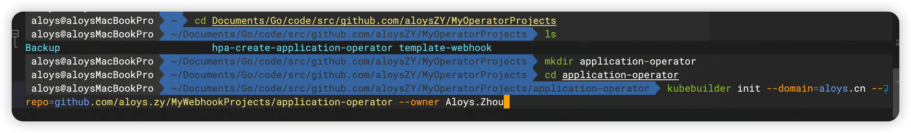

### 2.创建API

```bash
kubebuilder create api --group apps --version v1 --kind Application

--group apps: 指定 CRD 的组名，这里为 apps。
--version v1: 指定 CRD 的版本，这里为 v1。
--kind ApplicationH: 指定 CRD 的种类，这里为 Application
```

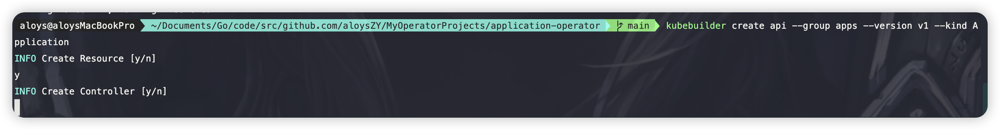

### 3.创建CRD配置

```bash
make manifests
```

### 4.部署安装CRD

```bash
#部署crd
make insatll
#卸载CRD
make uninstall
```

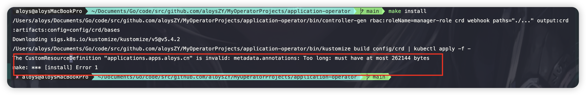

#### 问题说明

> 这里有一个报错,apply 修改为create
>
> 

### 5.查询CRD

```bash
kubectl get crd
```

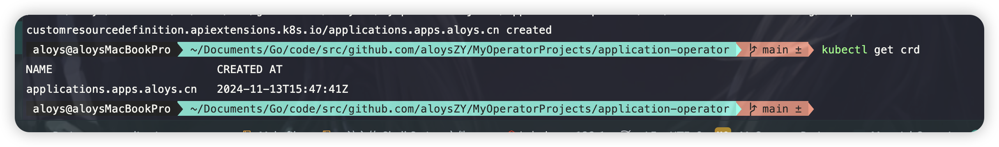

这时候集群内就存在这个CRD资源了，就是kube-apiserver已经可以识别这个资源了

### 6.创建CR 

```bash
kubectl apply -f config/samples/apps_v1_application.yaml
```

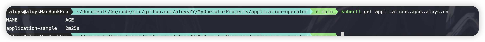

### 7.controller实现

根据需求进行Reconcile编写和ApplicationSpec定义

### 8. 本地运行测试

```bash
make run
```

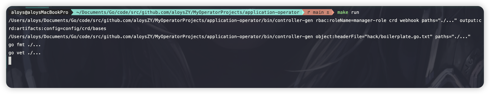

### 9.部署执行和卸载

```bash
#编译成镜像
make docker-build IMG=application-operator:v0.0.1 
#导入镜像到kind集群
kind load docker-image  application-operator:v0.0.1 --name aloys
#部署controller资源到集群
make deploy IMG=application-operator:v0.0.1 
#卸载controller
make undeploy IMG=application-operator:v0.0.1 
```

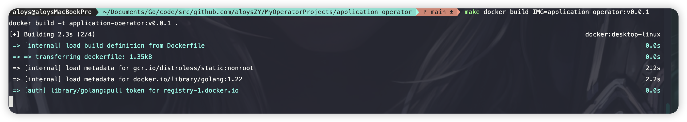

#### 问题说明

> 1.容器内下载go失败，添加配置ENV GOPROXY=https://goproxy.io
>
> 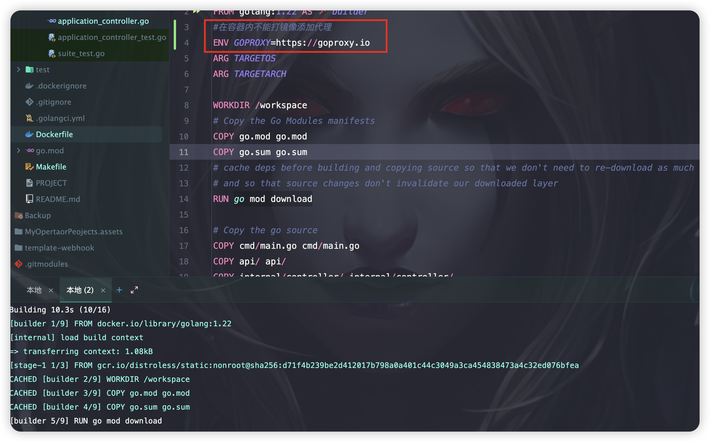
>
> 2.提示文件太长报错，修改为create
>
> 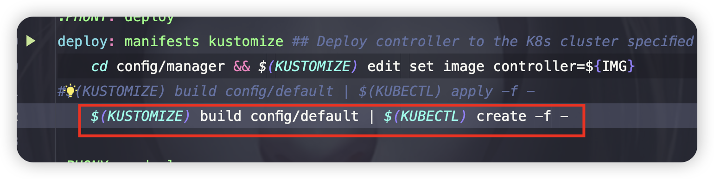

# 二、kubernetes API介绍

## 1. Curl 方式访问

```bash
#使用8080将6443暴露出来，并且是http方式
kubectl proxy --port=8080
#--data-binary 参数后面跟着的是要发送的文件名（在这个例子中是 nginx-deploy.yaml），它会将文件的内容作为请求体的一部分发送出去。
curl --data-binary @nginx-deploy.yaml 
```

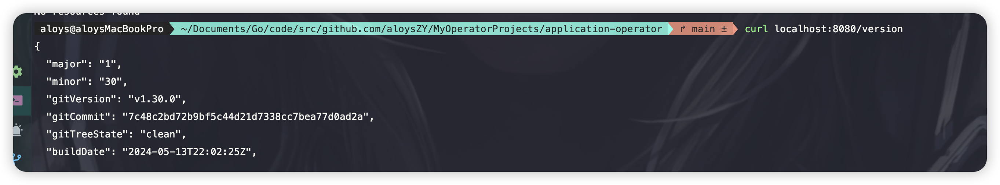

## 2.raw方式

`kubectl --raw` 可以用来发送任何类型的 HTTP 请求，包括 `GET`、`POST`、`PUT`、`DELETE` 等。以下是一些示例：

### 1. 发送 `GET` 请求

```bash
kubectl --raw='/api/v1/namespaces/default/pods' -v=6
```

这里 `-v=6` 是增加日志详细程度，以便查看请求和响应的详细信息。

### 2. 发送 `POST` 请求

假设您有一个 YAML 文件 `nginx-deploy.yaml`，您可以通过 `--raw` 发送 `POST` 请求来创建资源：

```bash
kubectl --raw='/apis/apps/v1/namespaces/default/deployments' -X POST -H 'Content-Type: application/yaml' --data-binary @nginx-deploy.yaml
```

### 3. 发送 `PUT` 请求

假设您有一个 YAML 文件 `nginx-deploy-update.yaml`，您可以通过 `--raw` 发送 `PUT` 请求来更新资源：

```bash
kubectl --raw='/apis/apps/v1/namespaces/default/deployments/nginx-deployment' -X PUT -H 'Content-Type: application/yaml' --data-binary @nginx-deploy-update.yaml
```

### 4. 发送 `DELETE` 请求

假设您要删除一个名为 `nginx-deployment` 的 Deployment：

```bash
kubectl --raw='/apis/apps/v1/namespaces/default/deployments/nginx-deployment' -X DELETE
```

### 5.注意事项

1. **认证和授权**：确保您有足够的权限来执行这些操作。Kubernetes 通常需要认证和授权，您可以通过 `kubeconfig` 文件中的凭据进行认证。
2. **API 版本**：确保您使用的 API 路径和版本是正确的。不同的资源类型和操作可能有不同的 API 路径。
3. **内容类型**：对于 `POST` 和 `PUT` 请求，确保设置了正确的 `Content-Type` 头，通常是 `application/yaml` 或 `application/json`。

### 6.示例：完整的 `POST` 请求

假设您有一个 `nginx-deploy.yaml` 文件，内容如下：

```yaml
apiVersion: apps/v1
kind: Deployment
metadata:
  name: nginx-deployment
  namespace: default
spec:
  replicas: 3
  selector:
    matchLabels:
      app: nginx
  template:
    metadata:
      labels:
        app: nginx
    spec:
      containers:
      - name: nginx
        image: nginx:1.7.9
        ports:
        - containerPort: 80
```

您可以使用以下命令将其发送到 Kubernetes API 服务器：

```bash
kubectl --raw='/apis/apps/v1/namespaces/default/deployments' -X POST -H 'Content-Type: application/yaml' --data-binary @nginx-deploy.yaml
```

# 三、client-go

### 1.in-cluster-configuration

https://github.com/aloysZY/MyOperatorProjects代码地址

```bash
GOOS=linux GOARCH=arm64 go build -v -o ./in-cluster .
docker build -t in-clister:v1 .
kind load docker-image in-clister:v1 --name=aloys
kubectl run -i in-cluster --image=in-cluster:v1 --image-pull-policy=IfNotPresent
```

### 2.out-of-cluster-configuration

```bash
GOOS=linux GOARCH=arm64 go build -v -o ./out-cluster .
```

### 3、client-go分析（后补）

# 四、opertaor开发

## 1、创建项目

### 1.创建项目骨架

```bash
kubebuilder init --domain=aloys.cn --repo=github.com/aloys.zy/aloys-application-operator --owner Aloys.Zhou
```

> 如果要修改项目名称：
>
> 1）PROJECT文件中的projectName配置
>
> 2）config/default/kustomization.yaml 的namespace和namePrefix配置

### 2.创建api

```bash
kubebuilder create api --group apps --version v1 --kind Application 
```

> aloys-application-operator/api/v1/application_types.go 下// +kubebuilder:object:root=true 是一个特殊标记，主要是conteoller-tools识别，这个对象生成器认为这是一个Kind，会生成kind所需的代码（一个结构体要表示为一个Kind，必须要要实现runtime.Object接口），就是会生成aloys-application-operator/api/v1/zz_generated.deepcopy.go文件，就是实现了这个接口

### 3.自定义字段

aloys-application-operator/api/v1/application_types.go ，新增自定义字段信息，就是CR部署的时候需要用到的信息

```go
type DeploymentTemplate struct {
	// INSERT ADDITIONAL SPEC FIELDS - desired state of cluster
	// omitempty 意味着在编码（序列化）结构体为 JSON 字符串时，如果该字段的值是其零值（zero value），则该字段将不会出现在生成的 JSON 字符串中
	appv1.DeploymentSpec `json:",omitempty"`
}

type ServiceTemplate struct {
	// INSERT ADDITIONAL SPEC FIELDS - desired state of cluster
	corev1.ServiceSpec `json:",omitempty"`
}

// ApplicationSpec defines the desired state of Application.
// 自定义资源的字段，就是cr yaml里面要填写的信息
type ApplicationSpec struct {
	// INSERT ADDITIONAL SPEC FIELDS - desired state of cluster
	// Important: Run "make" to regenerate code after modifying this file

	// Foo is an example field of Application. Edit application_types.go to remove/update
	// Foo string `json:"foo,omitempty"`
	Deployment DeploymentTemplate `json:"deployment,omitempty"`
	Service    ServiceTemplate    `json:"service,omitempty"`
}

// ApplicationStatus defines the observed state of Application.
// 并不是严格对应的“实际状态”，而是观察记录下的当前对象的最新“状态”
type ApplicationStatus struct {
	// INSERT ADDITIONAL STATUS FIELD - define observed state of cluster
	// Important: Run "make" to regenerate code after modifying this file
	Workflow appv1.DeploymentSpec `json:"workflow,omitempty"`
	Network  corev1.ServiceSpec    `json:"network,omitempty"`
}
```

### 3.实现调谐逻辑

aloys-application-operator/internal/controller/application_controller.go 中的Reconcile函数内实现具体的调谐逻辑

### 4.添加权限

aloys-application-operator/internal/controller/application_controller.go 最上面有添加权限的地方，直接添加注解，使用make manifests会生成相关权限

这里因为调谐逻辑中涉及到deployment和service的操作，所以配置了这个权限

```go
// +kubebuilder:rbac:groups=apps.aloys,resources=deployments,verbs=get;list;watch;create;update;patch;delete
// +kubebuilder:rbac:groups=apps.aloys,resources=deployments/status,verbs=get
// +kubebuilder:rbac:groups=apps.aloys,resources=services,verbs=get;list;watch;create;update;patch;delete
// +kubebuilder:rbac:groups=apps.aloys,resources=services/status,verbs=get
```

### 5.配置SetupWithManager

aloys-application-operator/internal/controller/application_controller.go

```go
//可以配置字段
SkipNameValidation      *bool
    MaxConcurrentReconciles int
    CacheSyncTimeout        time.Duration
    RecoverPanic            *bool
    NeedLeaderElection      *bool
    Reconciler              reconcile.TypedReconciler[request]
    RateLimiter             workqueue.TypedRateLimiter[request]
    NewQueue                func(controllerName string, rateLimiter workqueue.TypedRateLimiter[request]) workqueue.TypedRateLimitingInterface[request]
    LogConstructor          func(request *request) logr.Logger
```

### 6.添加别名

aloys-application-operator/api/v1/application_types.go

```go
// +kubebuilder:resource:path=applications,singular=application,scope=Namespaced,shortName=app
type Application struct {
	metav1.TypeMeta   `json:",inline"`
	metav1.ObjectMeta `json:"metadata,omitempty"`

	Spec   ApplicationSpec   `json:"spec,omitempty"`
	Status ApplicationStatus `json:"status,omitempty"`
}
```

### 7.自定义打印列

添加kubectl get 返回列信息

```go
// +kubebuilder:printcolumn:name="Replicas",type="integer",JSONPath=".spec.deployment.replicas"
// +kubebuilder:printcolumn:name="UpdatedReplicas",type="string",JSONPath=".spec.deployment.replicas.updatedReplicas"
// +kubebuilder:printcolumn:name="Age",type="date",JSONPath=".metadata.creationTimestamp"
```


# 二、Github 添加子仓库

在子目录下先创建 

```bash
git rm -r --cached aloys-application-operator 
rm 'aloys-application-operator'

git commit -m "init aloys-application-operator"
[main b04a19d] init aloys-application-operator
 1 file changed, 1 deletion(-)
 delete mode 160000 aloys-application-operator

git submodule add https://github.com/aloysZY/aloys-application-operator.git aloys-application-operator
Adding existing repo at 'aloys-application-operator' to the index

git commit -m "init aloys-application-operator"
[main 8aed5b1] init aloys-application-operator
 2 files changed, 4 insertions(+)
 create mode 160000 aloys-application-operator

```

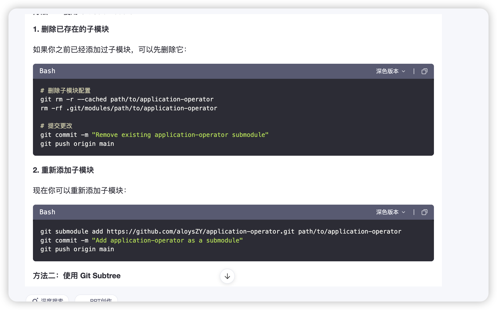
